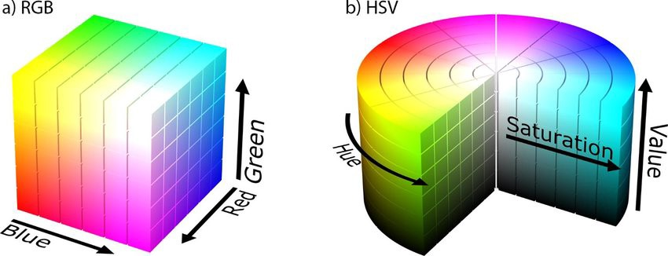

# NTUOSS TGIFHacks CV Workshop
## Goal
Implement the vision pipeline for a straight line following Robot.

## Setup - Computer Vision with OpenCV

### Step 1

```sh
git clone https://github.com/arumugam666/NTUOSS-CV-workshop.git
```
### Step 2
Windows:
```sh
cd NTUOSS-CV-workshop; python -m venv workshop-env; .\workshop-env\Scripts\activate; python -m pip install -r requirements.txt
```

Mac/ Linux:
```sh
cd NTUOSS-CV-workshop; python3 -m venv workshop-env; source workshop-env/bin/activate; python3 -m pip install -r requirements.txt
```
## Loading, Displaying and Writing images

An image can be loaded using the below code snippet
```python
import cv2
img = cv2.imread("./Images/cat.jpg")
```

The image can be diplayed using the `cv2.imshow` function
```python
cv2.imshow("cat", img)
cv2.waitKey(0)
```

The image can be written using the `cv2.imwrite` function
```python
cv2.imwrite("./Images/cat-copy.jpg", img)
```
## Working with the webcam

The webcam can be accessed using the following code snippet:
```python
import cv2

cap = cv2.VideoCapture(0)

while True:

    ret, frame = cap.read()
    if not ret:
        break

    cv2.imshow("webcam", frame)
    if cv2.waitKey(1) & 0xFF == 27:
        break
```
## Colorspaces - RGB and HSV


RGB uses 3 variables ranging from 0,255 - one each for Red, Green, and Blue.
## Thresholding using RGB values

## Pre processing

## Contour detection

## improving performance by background reduction